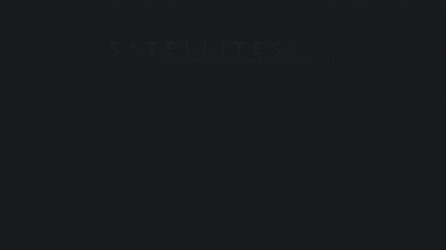

# Satellites

Winner of the [2021 RStudio table competition](https://www.rstudio.com/blog/winners-of-the-2021-table-contest/).

An interactive table of satellites built with [R Shiny](https://github.com/rstudio/shiny), [reactable](https://glin.github.io/reactable/) and [gt](https://gt.rstudio.com/).

[online](https://vfridkin.shinyapps.io/Satellites/) - 
[user guide](https://vfridkin.github.io/satellite_table_docs) - 
[video demo](https://youtu.be/ADWZs0MQkek)

The satellites are currently orbiting the Earth. 

Data is sourced from the Union of Concerned Scientists (UCS) [UCS Satellite Database](https://www.ucsusa.org/resources/satellite-database)

## Features

- View aggregated statistics (summary)

- View individual records (details)

- Add and reorder columns

- Filter by double clicking

- Add cell bars

- Animate measure range

- Change the measure statistic

- Save all the above in up to eight custom views

## Getting started

To run the app locally, you'll need [R](https://cran.r-project.org/) and [RStudio](https://www.rstudio.com/products/rstudio/) installed together with packages found in the `global.R` file.

## Getting help

The app has a help system accessible by clicking on the moon (top right corner) - built with [rintrojs](https://github.com/carlganz/rintrojs).
