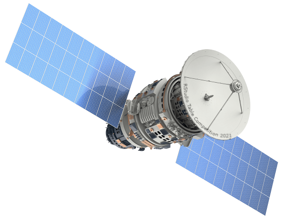

# 

# Satellites

An interactive table of satellite data built with R Shiny.

The satellites are those currently orbiting the Earth. 

It is compiled by the Union of Concerned Scientists (UCS) [UCS Satellite Database]([Satellite Database | Union of Concerned Scientists](https://www.ucsusa.org/resources/satellite-database)) 

# 

## Features

- View aggregated statistics (summary)

- View individual records (details)

- Add and reorder columns

- Filter by double clicking

- Add cell bars

- Animate measure range

- Change the measure statistic

- Save all the above in up to eight custom views
  
